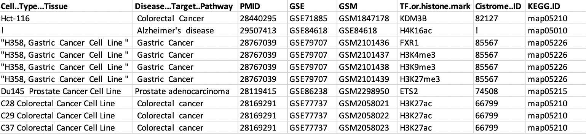

# GSABenchmarkTestAnalysis

This repository holds the test pipeline for the benchmark data. This could be referred to as a reckoner for anyone trying to conduct enrichment analysis on an independent benchmark dataset, referring to the below mentioned tools.

Tools to compare : **Chipenrich**, **Broadenrich**, **Seq2pathway**, **Enrichr**, and **GREAT**. The latter two have no dedicated R packages and have to be used via respective web-interfaces.

To conduct full scale analysis of our curated benchmark dataset, kindly source the data from:

```
library(devtools)
install_github("shauryajauhari/GSAChIPSeqBenchmarkData", force =TRUE)
library(GSAChIPSeqGold)
```

However, this test case dataset has the following profile.



P.S. Note that the jupyter notebook might run into execution errors due to larger memory dependencies. It is advisable to run the notebook with an increased *iopub data rate*. 

```
jupyter notebook --NotebookApp.iopub_data_rate_limit=10000000000
```